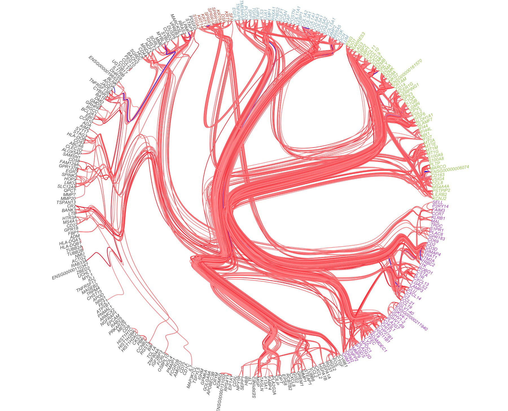

## Background
During the finalisation of my PhD, I implemented the so-called Hierachical Edge Bundling plotting method for a paper [now published](https://projecteuclid.org/euclid.aoas/1536652979) in the Annals of Applied Statistics.
Though the plot above sadly did not make the final cut, I admit due to an lack of added value, it appeared in the orignal submisson and the thesis. 
Suffice it to say, I was still quite pleased with the method at the time, so I wrapped the methods into an **R**-package called [**HierachicalEdgeBundles**](https://github.com/AEBilgrau/HierarchicalEdgeBundles). The plan was then to do a very small paper around this, but I never got around to it.

<!-- <span class="image main"></span> -->
<!--  -->

The plot above illustrates estimated correlations of selected genes within the diease called diffuse large B-cell lymphoma using the hierachical edge bundling method.


## What is hierachical edge bundling?
Hierachical edge bundles is a visualisation technique to display networks which has some hierachical structure and particularly the relations within such networks.
The method was originally suggested in 2006 in a [lovely paper](https://ieeexplore.ieee.org/document/4015425) by Danny Holten.
In short, Hierarchical edge bundling visualizes graphs (of nodes and edges) by guiding the edges along along a hierarchical tree of the nodes.
A bundling parameter then controls how tightly the edges follow this underlying tree. 

### The data 
The typical data suitable for this visualisation needs to basic properties:

* The data can be represented as a graph (directed or undirected)
* The data can be arranged hierachically 

If the data does not adhere to one of these properties the lacking properties may often be constructed. 
Now, I say 'data' here. But by 'data' I mean the data that goes in to the plotting method, not nessesarily the collected data.

Let us illustrate using the package in question:

## HierarchicalEdgeBundles package

### Installation
First thigs first. To install the package directly from the [repository on GitHub](https://github.com/AEBilgrau/HierarchicalEdgeBundles), we run:
```{r, eval=FALSE}
#install.packages("devtools")  # Uncomment if devtools is not installed
devtools::install_github("AEBilgrau/HierarchicalEdgeBundles")
```


### Illustration of data and package usage

To illustrate the package, we use a go-to data example in **R**. The `mtcars` dataset:

```{r}
data(mtcars)
head(mtcars, n = 10)
```

These data are various specs for 32 cars. 
It is easy to suppose that one would like to examine the 'closeness' of these cars to each other.
So it is natural to evaluate all pairs of cars by some metric. 
Using the euclidean metric we get:


```{r}
car_dist <- dist(mtcars) # Compute pairwise distances 

# Show first five rows and columns 
round(as.matrix(car_dist)[1:4, 1:4], 1)
```

These distance are (some) measure of distance between the cars. 
A larger value corresponds to a greater dissimilarity of the cars. 
We do not here bother to consider if the euclidian metrics is well suits (it is not).
Now, note that since this is a symmetric matrix, it can be represente as a complete weighted graph. 
The first of our two ingredients.

Using the  dissimilarities we can, for example, use regular hierachical clustering to arrive a the second ingredient:

```{r}
car_hc <- hclust(car_dist, "ave")
plot(car_hc)
```

A tree.

We happlily notice that similar cars indeed cluster together: Merc 450's are closely connceted; as are some automakers such as Fiat and Mazda. 


```{r, plots}
# library("HierarchicalEdgeBundles")
# library("igraph")
# library("ape")
# 
# graph <- watts.strogatz.game(1, size = 10, nei = 2, p = 0.5)
# adj.mat <- get.adjacency(graph)
# phylo <- as.phylo(hclust(as.dist(1-adj.mat)))
# 
# plot(graph, layout = layout_in_circle(graph))
# plotHEB(graph, phylo, type = "fan")
```


## References

* Danny Holten (2006) [**"Hierarchical Edge Bundles: Visualization of Adjacency Relations in Hierarchical Data"**](https://ieeexplore.ieee.org/document/4015425), IEEE Transactions on Visualization and Computer Graphics, 12 (5): 741-748.

